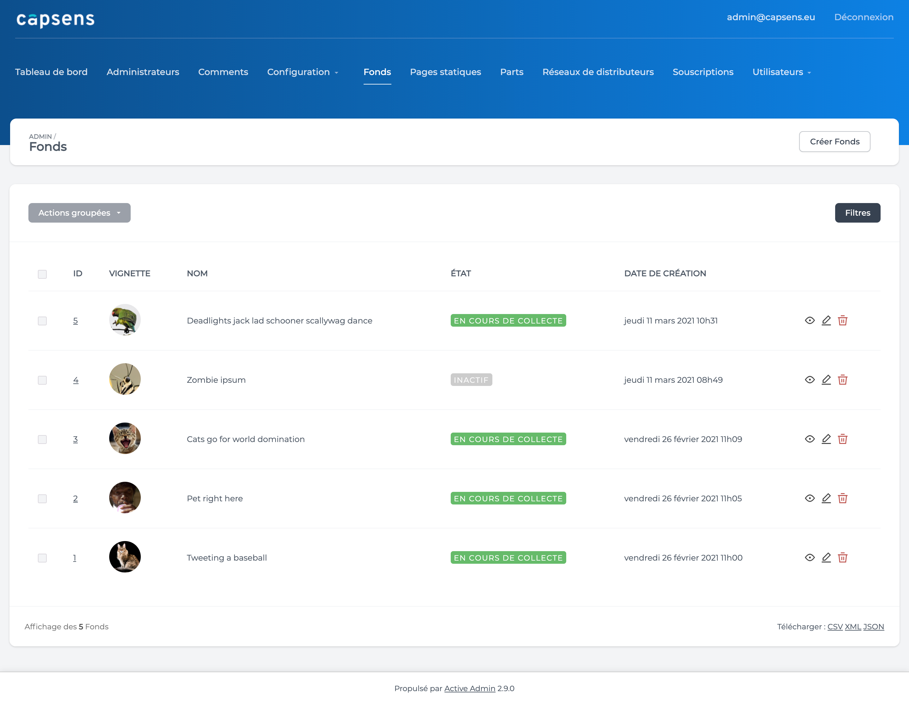
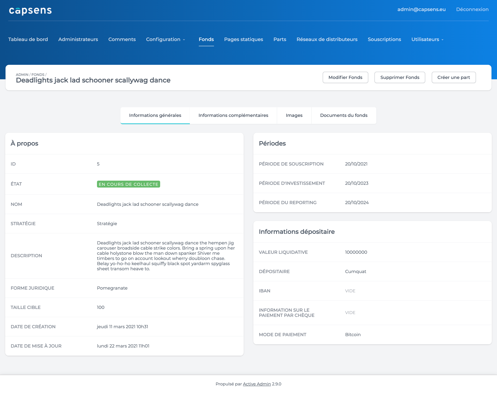
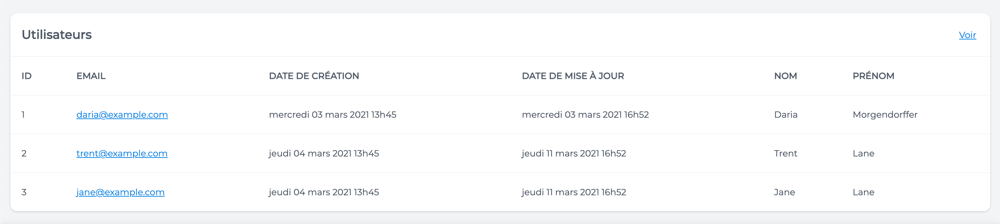

# light_admin - A minimal theme for ActiveAdmin




Design by Marie Ishihara  
Gem by CapSens

## Installation

- Add this line to your application's Gemfile:
```ruby
gem 'light_admin', git: 'git@github.com:CapSens/light_admin.git'
```

- And then run:
```
$ bundle install
```

- Make sure you have no other ActiveAdmin them installed before installing this gem!

## Pre-requisites
- This gem requires the activeadmin gem.  

## Set-up
- In `app/assets/javascripts/active_admin`, add the line: 
```
//= require capsens_theme/filters_toggle
```
- In `app/assets/stylesheets`, add the line:
```
@import 'light_admin/base';
```
- Your `active_admin.scss` file should look like this: <br>
```
@import 'active_admin/mixins';
@import 'active_admin/base';
@import 'light_admin/base';
``` 
You are good to go !

## Displaying a logo in the header 
- Import the image of your logo in `app/assets/images`
- In `config/initializers/active_admin.rb` uncomment the following line: <br>
```
# config.site_title_image = "logo.png"
```
- In place of `logo.png`, specify the name of your image and its extension: <br>
```
config.site_title_image = "name_of_your_image.png"
```
> Restart your Rails server so the changes take effect. 


## Displaying a logo on the login page
- Place your image in `app/assets/images/devise/sessions`.
- Run: 
```
$ rails generate light_admin:new_session
```
- Edit the commented lines in `app/views/active_admin/devise/sessions/new.html.erb`

## Customizing variables 
- By default, variables are stored within the gem. If you want to edit them: 
```
$ rails generate light_admin:variables
```
- Then you can edit the variables in the following files: <br>
`app/assets/stylesheets/light_admin/custom_variables/_colors.scss`  
`app/assets/stylesheets/light_admin/custom_variables/_font.scss`  
`app/assets/stylesheets/light_admin/custom_variables/_borders.scss`  
`app/assets/stylesheets/light_admin/custom_variables/_shadows.scss`  

- Then, import your changed variables in `app/assets/stylesheets/active_admin.scss` above the light admin base scss file, it should look like this if you have changed only colors:
```
@import 'active_admin/mixins';
@import 'active_admin/base';
@import 'light_admin/custom_variables/colors';
@import 'light_admin/base';
``` 

## Panel with link

`panel_with_link` behaves the same of ActiveAdmin's `panel`,  except that it can also display links. 
- If you want to use `panel_with_link`, you only need to call the `panel_with_link` method where you need it (for example, in your show page) and define its attributes like usual with ActiveAdmin.

- Here is the code for the above screenshot:
```
panel_with_link t('users'), 'Voir tous', admin_users_path do
  table_for user do
    column :id
    column :email do
      link_to user.email, admin_user_path
    end 
    column :created_at
    column :updated_at
    column :first_name
    column :last_name
  end
end
```

## Contributing

Bug reports and pull requests are welcome on GitHub at https://github.com/CapSens/light_admin

1. **Fork** the repo on GitHub
2. **Clone** the project to your own machine
3. **Commit** changes to your own branch
4. **Push** your work back up to your fork
5. Submit a **Pull request** so that we can review your changes

NOTE: Be sure to merge the latest from "upstream" before making a pull request!

## License

The gem is available as open source under the terms of the [MIT License](https://opensource.org/licenses/MIT).

## Code of Conduct

Everyone interacting in the LightAdmin project's codebases, issue trackers, chat rooms and mailing lists is expected to follow the [code of conduct](https://github.com/Capsens/light_admin/blob/master/CODE_OF_CONDUCT.md).
